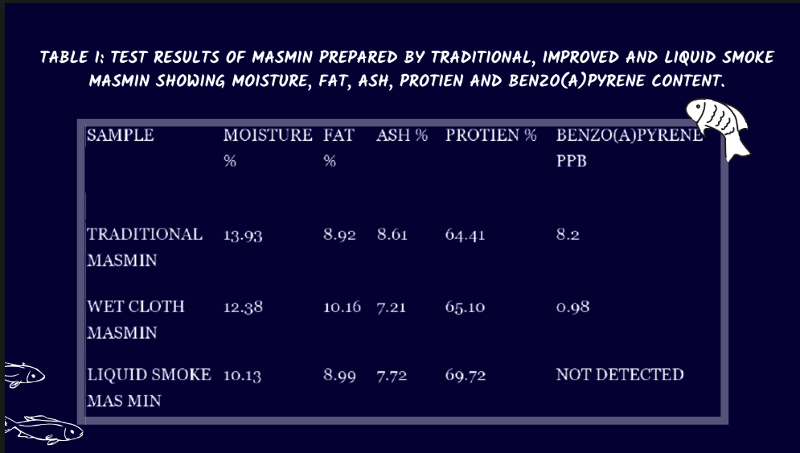

## ABSTRACT 

- Masmin is a smoked tuna dish which is a staple of the Lakshadweep people. But it contains a significant quantity of harmful chemicals like Benzopyrene.
- The main objective of the study was to compare the qualitative characteristics of masmin prepared using traditional and improved methods. Minor objectives are [1] To find out the chemical present in masmin prepared using traditional method. [2] To design and develop new equipment for smoking tuna better than traditional method.[3] To find out an improved method of tuna smoking using wet cloth and detachable smoker.[4] To find out properties of masmin prepared using liquid smoke. The chemical analysis of the masmin [smoked tuna] samples done at CIFT, mtasypuri, Wellington island showed that masmin prepared by traditional method contained large amounts of Benzopyrene carcinogen.
- The new equipment designed, a detachable smoker, was found to be Very effective in reducing the Benzopyrene content of the final product. A steamer was modified for the same and was able to smoke tuna properly and in a nutritious manner.
- The tuna sample prepared by use of liquid smoke had no/negligible quantity of benzopyrine. This is because Benzopyrene and other similar chemicals are attracted to lipids present in the tuna but are insoluble in water, the medium for liquid smoke.
- At present, masmin containing large amounts of such carcinogens is the leading cause of cancer, ulcers and other illnesses related to digestive tract. The detachable smoker can be made by modifying steamer available in the market and this can be easily done by the fishermen to produce a safe and more nutritious masmin.

